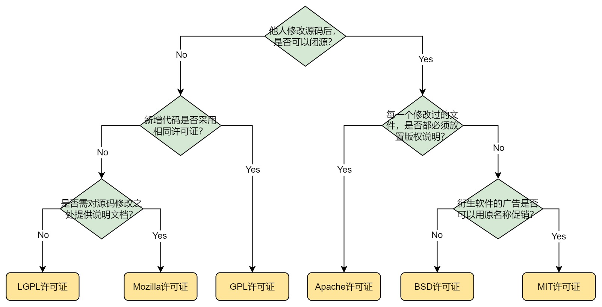
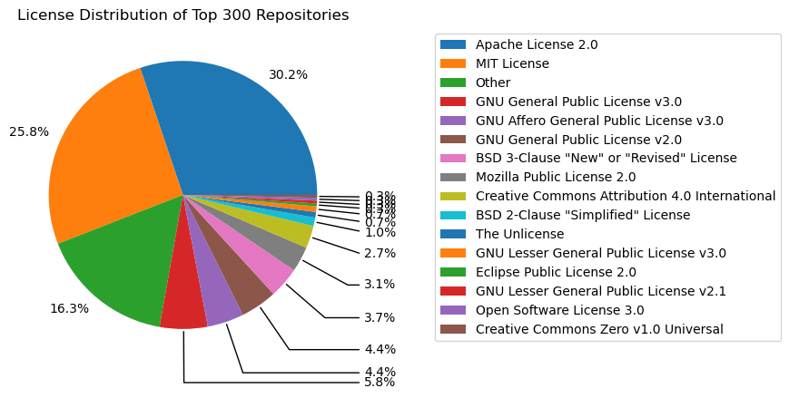

# 流行项目Top300数据洞察报告
GitHub是全球最大的开源代码托管平台之一，每年都会有大量的项目在其平台上诞生和发展。本报告将对2023年度GitHub排名前300的项目数据进行分析，从项目语言、规模、活跃度、开源协议等方面进行分析。通过这些数据，我们可以了解到目前开源社区的发展趋势和项目的受欢迎程度。
## 一、项目分析
### 1. 总体数据概览

### 2. 项目语言分析

### 3. 项目规模分析

### 4. 项目活跃度分析

### 5. 项目开源许可证分析
近年来，开源开发作为软件技术创新和软件产业发展的主要模型，以其充分共享、自由协同、无偿贡献、用户创新、持续演化的新特征，吸引着诸多开发者和企业。开源软件，顾名思义就是开放源代码的软件，即人们能够免费且不受限制地使用、再开发、再发布的软件。然而开源软件的开发和使用伴随着诸多风险，其中最大的风险之一就是潜在的知识产权侵权责任。为了保护开源软件的版权和进一步推进自由开源软件（free and open source software）的发展，开源许可证应运而生，它规范了软件的使用、修改、重新发布、担保和归属，开发者通常会为其项目选择合适的开源许可证以保证自己的知识产权被合理利用。

开源许可证的选择对项目的开发和演化以及软件的使用和商业化而言都至关重要。本小节通过对流行项目Top300所使用的开源协议进行详细分析解读，包括常见开源许可证简介及分类、流行项目开源许可证现状分析、开源协议对项目发展的影响分析等内容，以期为开发者了解这些流行项目以及为自己项目选择合适开源协议提供支持。

#### 5.1 常见开源许可证及分类
开源许可证是一种针对开源软件使用者的约束，目的在于规范受著作权保护的软件的使用或者分发行为。常见开源许可证如下：
* Apache 许可证: 由Apache软件基金会发布的自由软件许可证，最初为Apache Http服务器而撰写，于2004年1月发布，它要求被授权者保留著作权和放弃权利的声明，但它不是一个反著作权的许可证，因为它不强制衍生软件必须使用相同的许可证进行发布。
* MIT 许可证：其名源自麻省理工学院，又称“X许可证”或“X11许可证”。其特点和BSD许可证类似，只要在项目的所有副本中包含版权声明和许可声明即可。
* BSD：BSD许可证是自由软件中使用广泛的许可协议之一，源自加州大学伯克利分校。其特点是可以自由使用、修改、在发布，但在商用或个人分发过程中必须带有原来代码的许可证，且不能用原作者相关信息去宣传。
* GPL 许可证：GPL主张代码及衍生代码的开源，不允许修改后作为闭源商业软件进行发布和出售。如果已发布商业软件源码里含有GPL开源软件源码，则必须对该商业软件进行开源或者下架处理。
* AGPL 许可证：AGPL是GPL的一个补充，在GPL基础上增加了一些限制，GPL的约束生效前提是该软件“发布”，因此有的公司使用GPL组件编写系统，但不发布，只提供在线服务以避免开源系统代码。而AGPL要求若云服务用到的代码数该许可证，那么云服务代码也必须开源。
* LGPL 许可证：LGPL也是GPL的一个补充，它允许商业软件通过类库引用的方式使用LGPL类库，而不需要开源商业软件源码。
* MPL 许可证：在商业软件中，如果含有MPL许可证的代码在单独的文件内，其他新增的文件就可以避免开源。

因此我们可总结上述开源协议区别如下图所示。

从上面的划分可以看出开源许可证的最大差异是许可证对分发衍生软件的限制性不同，即当他人对代码修改和扩展（与其他软件合并）后并分发的限制要求。目前，开源许可证按照限制的强弱通常分为以下3种类型：
* 宽松型（Permissive）：这类许可证通常只要求被许可方承认原始作者，衍生软件可以称为私有软件，如BSD系列许可证、MIT、Apache-2.0和MulanPSL-2.0.
* 限制型（Copyleft）：旨在促进开发人员的合作，保护源代码的自由共享。Copyleft条款要求对软件的修改和扩展，必须按照获得该软件的许可证进行开源，如GPL系列许可证、OSL系列许可证。
* 弱限制型（Weak-Copyleft）：弱限制型许可证要求对软件的修改，重新分发必须按照获得该软件的许可证进行开源，然而合并这些软件的大型作品可以成为私有作品。这是个折中的方法，允许将代码继承到自己的软件中，而不必使整个代码库开源，避免了不得不分享的场景。

#### 5.2 开源许可证使用现状统计分析
了解了常见开源许可证及其类别后，我们针对流行项目Top300所使用的开源许可证进行统计分析，首先从top300_20_23log日志数据中清洗出repo_name和repo_license字段用于分析，得到开源协议使用占比统计结果如下图所示。从中我们发现排名最高的三种开源协议为Apache License 2.0、MIT License和Other，其中Other表示该仓库未明确给出协议，即表明在Top300项目中宽松型开源许可证占主导地位，限制型次之，而弱限制型的开源许可证并不常见。

然后我们对使用同类开源许可证项目的star数和fork进行统计分别展示如下所示，此处我们简单以star数和fork数代表项目的热度，可以发现热度较高的项目更倾向于使用GNU Affero General Public License V3.0和The Unlicense两类协议，其中GNU GPL V3.0属于限制型许可证，而The Unlicense属于宽松型许可证，且开源项目中占比排名较高的MIT License和Apache License 2.0两个许可证对应的项目热度也属于前列。

## 二、案例分析

